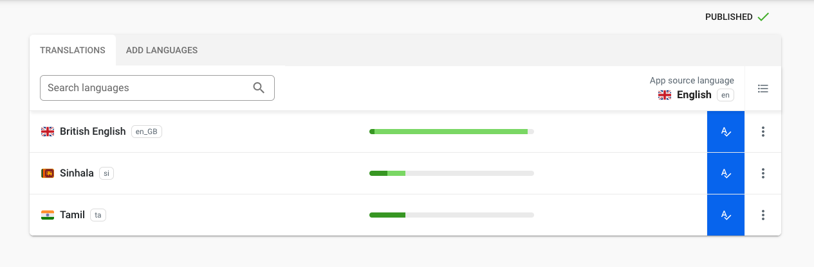

# react-localization-example

###Install Localazy
1. sign up for [Localazy](https://localazy.com/register)
2. [create an app](https://localazy.com/my/create). Select a source language.
3. select React integration option and install Localazy CLI
4. Upload your strings
- Install Localazy to the project using below command.

  `npm install -g @localazy/cli'`
 
 - Create a configuration file `localazy.json` in the root of your project.
     
       {
           "writeKey": "your-write-key",
           "readKey": "your-read-key",
           
           "upload": {
               "type": "json",
               "files": "src/assets/locales/si.json"
           },
           
           "download": {
             "files": "src/assets/locales/${lang}.json"
           }
       }
       
     
   
- Access [Localazy CLI](https://localazy.com/p/data.ekamuthu) to add languages to the project and see translations.
   
- Upload the source strings by giving `localazy upload` command in terminal whenever you change them.

- Download translated files by giving `localazy download` command in terminal before building your app.  
     

###Install i18n
`npm install react-i18next i18next --save`

- add `i18n.js` to src folder and import ${lang}.json files downloaded from localazy

{

    import i18n from 'i18next';
    import { initReactI18next } from 'react-i18next';
  
    import en from "./assets/locales/en.json"
    import si from "./assets/locales/si.json"
    import ta from "./assets/locales/ta.json"
  
      const resources = {
          en,si, ta
      }
      
      i18n
          .use(initReactI18next)
          .init({
              resources,
              lng: "si",
              interpolation: {
                  escapeValue: false
              }
          });
      
      
      export default i18n;
  }
  
- use `useTranslation` object of i18next package in the content to switch between languages. 

    `const { t } = useTranslation();`
    
    `<h1>{t('sample_para')}</h1>`
    
    sample_para is the key of the text in language files translated using localazy.
    
    Refer App.js file to understand how i18next works.
    
